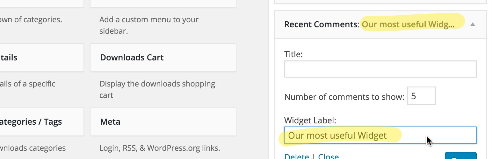

<!-- DO NOT EDIT THIS FILE; it is auto-generated from readme.txt -->
# Widget Labels

Add custom labels/titles to any WordPress widget.

**Contributors:** [generatewp](https://profiles.wordpress.org/generatewp), [maor](https://profiles.wordpress.org/maor), [ramiy](https://profiles.wordpress.org/ramiy)  
**Tags:** [widgets](https://wordpress.org/plugins/tags/widgets), [widget label](https://wordpress.org/plugins/tags/widget label), [label](https://wordpress.org/plugins/tags/label), [widget](https://wordpress.org/plugins/tags/widget)  
**Requires at least:** 4.0  
**Tested up to:** 4.9  
**Stable tag:** 1.1.2  
**Requires PHP: ** 5.2.4  
**License:** [GPLv2 or later](http://www.gnu.org/licenses/gpl-2.0.html)  

## Description ##

This simple, but useful plugin that lets you control what label shows next to each Widget in your WordPress dashboard. The idea behind is to allow better organization of your widgets, as well as to give you a bit more control and flexibility over this already-built-in WordPress feature.

It's very handy in cases where you'd like your clients to know something before updating a certain widget. We might even change this up in the future and change it up to a `<textarea>` field.

In the meanwhile — enjoy, and feel free to contribute / send pull requests our way [over at GitHub](https://github.com/maor/wp-widget-labels).

## Screenshots ##

### WordPress widget with the new "Widget Label" field.

## Changelog ##

### 1.1.2 - January 26, 2017 ###
* Merge the i18n file to the main class.
* Tested up to WordPress 4.9.
* Requires PHP 5.2.4.

### 1.1.1 - April 24, 2016 ###
* Fixed PHP Warning (bug)
* Added help text for the label field

### 1.1.1 - April 24, 2016 ###
* Fixed PHP Warning (bug)
* Added help text for the label field

### 1.1.0 - April 7, 2016 ###
* Prevent direct access to php files.
* Prevent direct access to directories.
* Use [translate.wordpress.org](https://translate.wordpress.org/) to translate the plugin.
* Add more phpDocs.

### 1.0.0 - April 6, 2016 ###
* Initial release.
